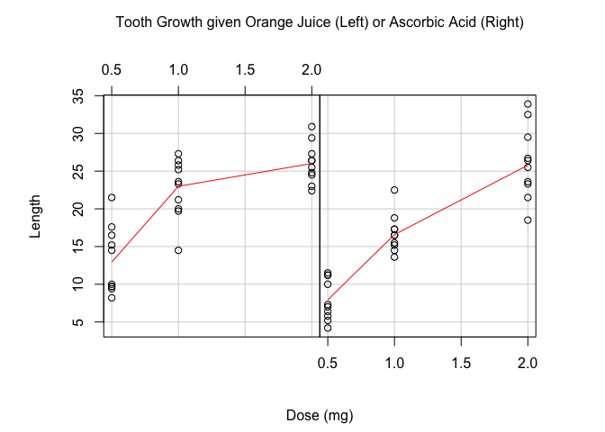
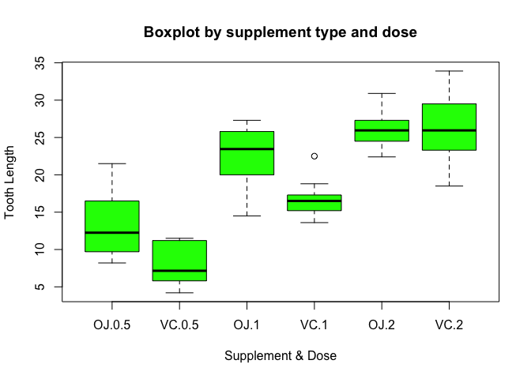
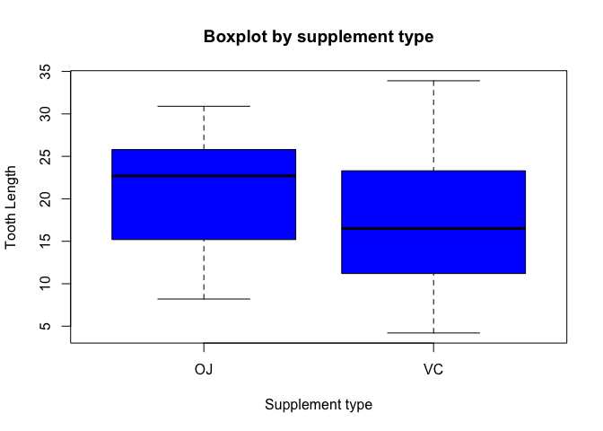

# Statistical Inference Assignment Part 2
agcode  
24 December 2015  

---

## Tooth Growth Analysis 

---

### I. Overview

This exercise is going to analyze the ToothGrowth data in the R datasets package.

List of actions: 

- Load the ToothGrowth data and some basic exploratory data analyses 
- A basic summary of the data.
- Use confidence intervals and/or hypothesis tests to compare tooth growth by supp and dose.
- Conclusions and the assumptions needed for conclusions.

---

### II. Loading the ToothGrowth data and performing basic exploratory data analyses 

The following code loads the ToothGrowth dataset in R. After loading the dataset, some basic exploratory data analyses is performed:


```r
# Loading the dataset
data(ToothGrowth)
# Basic information about the dataset
str(ToothGrowth)
```

```
## 'data.frame':	60 obs. of  3 variables:
##  $ len : num  4.2 11.5 7.3 5.8 6.4 10 11.2 11.2 5.2 7 ...
##  $ supp: Factor w/ 2 levels "OJ","VC": 2 2 2 2 2 2 2 2 2 2 ...
##  $ dose: num  0.5 0.5 0.5 0.5 0.5 0.5 0.5 0.5 0.5 0.5 ...
```

```r
library(graphics)
  coplot(len ~ dose | supp, ToothGrowth, panel = panel.smooth, 
         show.given = FALSE, ylab = "Length", 
         xlab = c("Dose (mg)", 
                  "Tooth Growth given Orange Juice (Left) or Ascorbic Acid (Right)"))
```

 

---

### III. Summary of the data 

This dataset represents the Effect of Vitamin C on Tooth Growth in Guinea Pigs, according to the R Documentation. It contains the length of odontoblasts (teeth) in each of 10 guinea pigs at each of three dose levels of Vitamin C (0.5, 1, and 2 mg) with each of two delivery methods (orange juice or ascorbic acid).

A data frame with 60 observations on 3 variables.

- [,1]   len	 numeric	 Tooth length
- [,2]	 supp	 factor	 Supplement type (VC or OJ).
- [,3]	 dose	 numeric	 Dose in milligrams.


```r
# Basic summary of the data
summary(ToothGrowth)
```

```
##       len        supp         dose      
##  Min.   : 4.20   OJ:30   Min.   :0.500  
##  1st Qu.:13.07   VC:30   1st Qu.:0.500  
##  Median :19.25           Median :1.000  
##  Mean   :18.81           Mean   :1.167  
##  3rd Qu.:25.27           3rd Qu.:2.000  
##  Max.   :33.90           Max.   :2.000
```

```r
# Boxplot by supplement type and dose
boxplot(len ~ supp * dose, ToothGrowth, col="green", ylab="Tooth Length", xlab="Supplement & Dose",main="Boxplot by supplement type and dose") 
```

 

```r
# Boxplot by supplement
boxplot(len ~ supp, ToothGrowth, col="blue", ylab="Tooth Length", xlab="Supplement type",main="Boxplot by supplement type") 
```

 

---

### IV. Compare tooth growth by supp and dose
Using confidence intervals and/or hypothesis tests, we compare tooth growth by supp and dose.


```r
# The T-test at 0.5 mg
t.test(len ~ supp, ToothGrowth[ToothGrowth$dose == .5, ])
```

```
## 
## 	Welch Two Sample t-test
## 
## data:  len by supp
## t = 3.1697, df = 14.969, p-value = 0.006359
## alternative hypothesis: true difference in means is not equal to 0
## 95 percent confidence interval:
##  1.719057 8.780943
## sample estimates:
## mean in group OJ mean in group VC 
##            13.23             7.98
```

```r
# The T-test at 1 mg
t.test(len ~ supp, ToothGrowth[ToothGrowth$dose == 1, ])
```

```
## 
## 	Welch Two Sample t-test
## 
## data:  len by supp
## t = 4.0328, df = 15.358, p-value = 0.001038
## alternative hypothesis: true difference in means is not equal to 0
## 95 percent confidence interval:
##  2.802148 9.057852
## sample estimates:
## mean in group OJ mean in group VC 
##            22.70            16.77
```

```r
# The T-test at 2 mg
t.test(len ~ supp, ToothGrowth[ToothGrowth$dose == 2, ])
```

```
## 
## 	Welch Two Sample t-test
## 
## data:  len by supp
## t = -0.046136, df = 14.04, p-value = 0.9639
## alternative hypothesis: true difference in means is not equal to 0
## 95 percent confidence interval:
##  -3.79807  3.63807
## sample estimates:
## mean in group OJ mean in group VC 
##            26.06            26.14
```

---

### V. Conclusions and Observations : 
 
The exploratory data analysis indicates that higher vitamin C dosages (in either orange juice[OJ] or pure ascorbic acid form[VC]) is an effective promoter of tooth growth.

The p-values generated by the T-tests above indicate that, for dosages of 0.5 mg and 1 mg, orange juice is more effective at promoting tooth growth.

Assumptions made: The observations are independent and identically distributed, random, the variances are different for the groups being compared in the t-tests, and the observations are unpaired.

---
