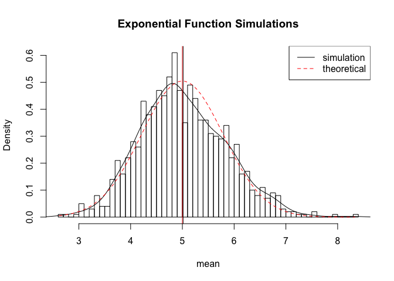
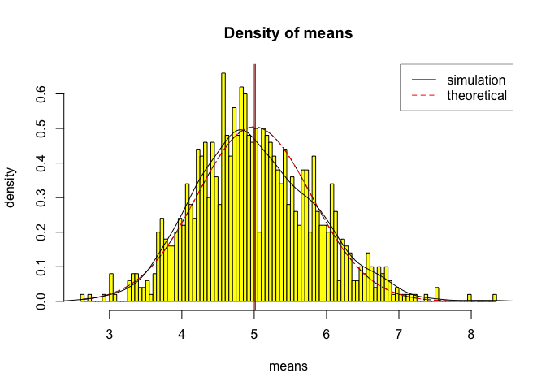
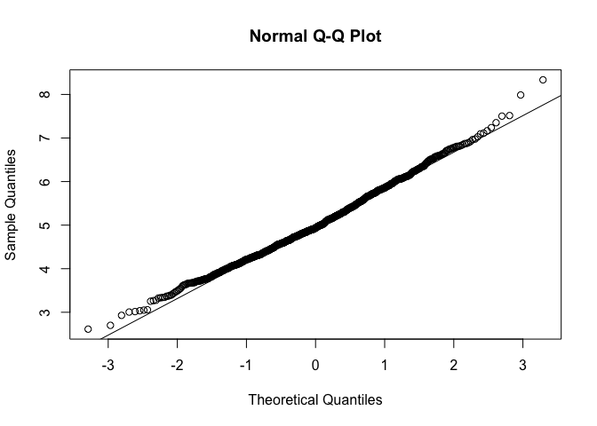

# Statistical Inference Assignment Part 1
agcode  
18 December 2015  

---

## Simulation exercise : Comparing an exponential distribution in R with the Central Limit Theorem

---

### I. Overview

This exercise is investigating the exponential distribution in R and comparing it with the Central Limit Theorem. 

The exponential distribution is be simulated in R with rexp(n, lambda) where lambda is the rate parameter. The mean of exponential distribution is 1/lambda and the standard deviation is also 1/lambda. 

* lambda = 0.2 for all of the simulations. 
* investigating the distribution of averages of 40 exponentials
* doing a thousand simulations.

*Known values: lambda = 0.2, n = 40, simulations = 1000*

---

### II. Simulations

The following code performs the simulations to create the necessary simulated data:


```r
# set seed for reproducability
set.seed(23)

# set lambda to 0.2
lambda <- 0.2

# 40 samples
n <- 40

# 1000 simulations
simulations <- 1000

# simulate n=1000
simulated_exponentials <- replicate(simulations, rexp(n, lambda))
```

---

### III. Sample Mean versus Theoretical Mean
The following code compares the theoretical mean and the sample mean.

Theoritical mean : The expected mean of a exponential distribution of rate *lambda* is *1/lambda*

Sample mean : The sample mean is calculated by using the *mean* function in R.


```r
# calculate mean of exponentials
means_exponentials <- apply(simulated_exponentials, 2, mean)
# Sample mean
sample_mean <- mean(means_exponentials)
sample_mean
```

```
## [1] 5.01425
```

```r
# analytical mean
theory_mean <- 1/lambda
theory_mean
```

```
## [1] 5
```

```r
# visualization
hist(means_exponentials, xlab = "mean", main = "Exponential Function Simulations", breaks= 50, prob=TRUE)
lines(density(means_exponentials))
abline(v=1/lambda, col="red")
abline(v=sample_mean, col="black")
# theoretical density of the averages of samples
xfit <- seq(min(means_exponentials), max(means_exponentials), length=100)
yfit <- dnorm(xfit, mean=1/lambda, sd=(1/lambda/sqrt(n)))
lines(xfit, yfit, pch=22, col="red", lty=2)
legend('topright', c("simulation", "theoretical"), lty=c(1,2), col=c("black", "red"))
```

 

##### Observation 

While the sample mean is 5.0142497 , the theoritical mean (*1/lambda*) is 5 . The difference between them is not significant and this is shown in the above visualisation. 

According to the Central Limit Theorem, given a sufficiently large sample size from a population with a finite level of variance, the mean of all samples from the same population will be approximately equal to the mean of the population.

---

### IV. Sample Variance versus Theoretical Variance
The following code calculates the sample variance and the theoritical variance and compares them. 

The theoretical variance of the population is given by sigma^2.


```r
# sample var
sample_var <- var(means_exponentials)
sample_var
```

```
## [1] 0.6862199
```

```r
# theoritical var
theory_var <- ((1/lambda)/sqrt(n))^2
theory_var
```

```
## [1] 0.625
```

```r
#Visualisation
hist(means_exponentials,breaks=90,prob=T,col="yellow",xlab = "means",main="Density of means",ylab="density")
lines(xfit, yfit, pch=22, col="black", lty=5)

xfit <- seq(min(means_exponentials), max(means_exponentials), length=100)
yfit <- dnorm(xfit, mean=1/lambda, sd=(1/lambda/sqrt(n)))
lines(xfit, yfit, pch=22, col="red", lty=2)
legend('topright', c("simulation", "theoretical"), lty=c(1,2), col=c("black", "red"))
lines(density(means_exponentials))
abline(v=1/lambda, col="red")
abline(v=sample_mean, col="black")
```

 

##### Observation : 

While the sample mean is 0.6862199 , the theoritical mean (*((1/lambda)/sqrt(n))^2*) is 0.625 . The difference between them is not significant and this is shown in the above visualisation.
 
The figure above shows the density computed using the histogram and the normal density plotted with theoretical mean have similar variance values.

---

### V. Distribution
As per the central limit theorem, the averages of samples follow normal distribution.  The theoretical quantiles again match closely with the actual quantiles.


```r
qqnorm(means_exponentials); qqline(means_exponentials)
```

 

##### Observation : 
 
The Q-Q plot compares two probability distributions by plotting their quantiles against each other. The normal Q-Q plot is comparing randomly generated, independent standard normal data on the vertical axis to a standard normal population on the horizontal axis. The linearity of the points suggests that the data are normally distributed.

---
